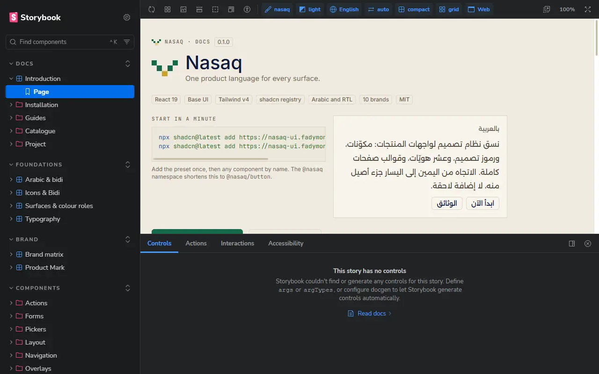
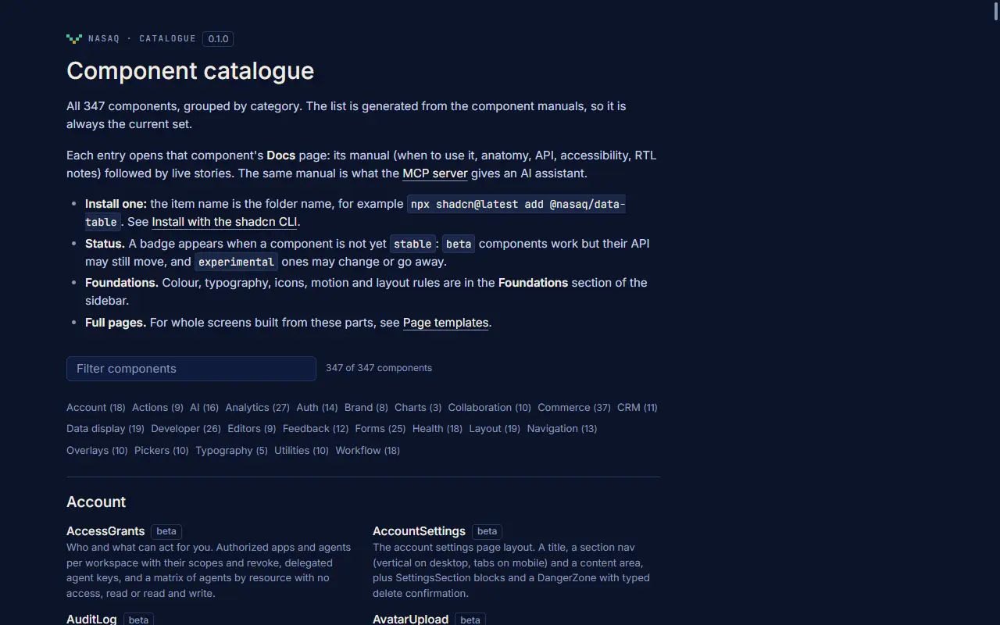
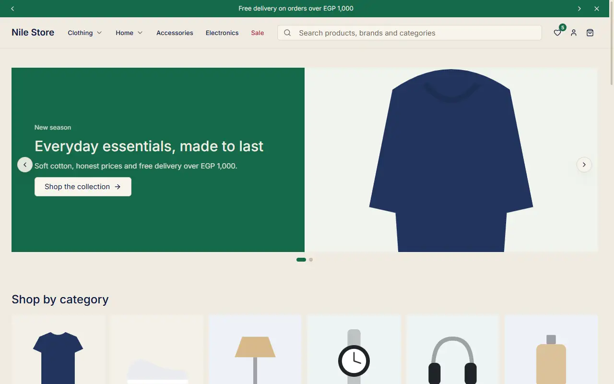

# Nasaq (نسق)

One product language for every surface: 354 React components, a token system, eleven brand themes and full page templates, built on Base UI and Tailwind CSS v4, with Arabic and right-to-left layout treated as a first-class case. Install it as a shadcn registry (you own the source) or, once the first release is out, as an npm package.

| | |
| --- | --- |
| Documentation and live components | https://docs.nasaqui.com |
| shadcn registry | https://docs.nasaqui.com/r/{name}.json (index: `/registry.json`) |
| MCP server (for AI tools) | https://mcp.nasaqui.com/mcp |
| Landing page | https://nasaqui.com |







## Status

Version 0.1.0. The components are in daily use in the author's own products, but the API is not frozen: expect changes between 0.x releases. The npm package `@fadymondy/nasaq` is prepared but **not published yet**; until it is, use the shadcn registry. Each component's manual carries a status of stable, beta or experimental.

## Quick start: shadcn registry

Works in any project that already runs shadcn (`components.json` present).

```bash
# once: the Nasaq preset (tokens, theme, provider)
npx shadcn@latest add https://docs.nasaqui.com/r/nasaq.json

# then any component by URL
npx shadcn@latest add https://docs.nasaqui.com/r/button.json

# a brand theme (11 available, theme-<brand>)
npx shadcn@latest add https://docs.nasaqui.com/r/theme-nasaq.json
```

To use the short `@nasaq/<name>` form, add the namespace to `components.json`:

```json
{
  "registries": {
    "@nasaq": "https://docs.nasaqui.com/r/{name}.json"
  }
}
```

```bash
npx shadcn@latest add @nasaq/button
```

The registry serves plain JSON with `Access-Control-Allow-Origin: *`, so it also works from other tools.

## Quick start: npm (pending the first release)

```bash
pnpm add @fadymondy/nasaq
```

```tsx
import { Button, NasaqProvider } from "@fadymondy/nasaq/web";
import "@fadymondy/nasaq/web/styles.css";
```

Entry points: `/web`, `/web/styles.css`, `/tokens`, `/tokens.css`, `/theme.css`, `/brands`, `/native` (React Native) and `/electron`. This section describes the intended package layout; it is not installable until the release is published.

## MCP server

Lets Claude, Cursor and other MCP clients search the components and read their manuals.

```bash
# hosted (streamable HTTP)
claude mcp add --transport http nasaq https://mcp.nasaqui.com/mcp

# or local over stdio
claude mcp add nasaq -- npx -y @fadymondy/nasaq-mcp
```

Tools: `get_setup`, `list_components`, `search_components`, `get_component`, `get_foundation`, `list_tokens`. The setup for Claude, Cursor and other clients is on the docs site under Docs, Guides, MCP server. The stdio package is likewise not on npm until it is released.

## Repository layout

```
apps/
  lab/          Storybook 10: the documentation site and every story; builds the static site and the registry
  site/         Next.js landing/brand site and the older registry builder
packages/
  web/          the React components (@nasaq/web, source of the registry)
  tokens/       DTCG design tokens, generated CSS and typed module
  brands/       brand manifests and marks
  icons/        icon set
  native/       React Native kit
  electron/     Electron window chrome
  feedback/     in-app feedback reporter
  mcp/          the MCP server
  nasaq/        the published package, @fadymondy/nasaq
  tooling/      lint and check tooling
scripts/        registry build and validation, component checks
docs/           architecture notes and design audits
```

## Development

Node 22 or newer and pnpm 11.

```bash
pnpm install
pnpm lab                                   # Storybook on http://localhost:6106

pnpm typecheck
pnpm lint                                  # logical properties only, no raw hex colours
pnpm test                                  # includes the token contrast matrix
pnpm check:components                      # every component has a valid README and a story

pnpm --filter @nasaq/site registry         # build and validate the shadcn registry
pnpm --filter @nasaq/lab build             # static docs + registry -> apps/lab/storybook-static
pnpm --filter @nasaq/lab serve             # serve that folder on http://127.0.0.1:6108
```

The static build is one folder: the docs, every story, the demo images, `r/*.json` and `registry.json`. `apps/lab/scripts/serve-static.mjs` is a dependency-free server for it (per-path cache headers and CORS for the registry files); see `docs/ARCHITECTURE.md` for the hosting notes. To run it as a long-lived service: `node apps/lab/scripts/serve-static.mjs --port 6108 --host 0.0.0.0`.

Contributions are welcome: see [CONTRIBUTING.md](CONTRIBUTING.md). Security reports: [SECURITY.md](SECURITY.md).

## Fonts, logos and brands

The MIT licence covers the source code and documentation. It does **not** cover the items below.

- **Fonts.** No font files are included in this repository or in the published site. The token stacks name Inter and Alexandria (open licences, loaded by the app that uses them) and IBM Plex Sans Arabic, with the Arabic display face Lusail first in the Arabic stack. Lusail is a commercial-licence face that is not redistributed here; where it is not installed the stack falls back to the next family. If you deploy Nasaq you are responsible for the licences of the fonts you load.
- **Logos and brand marks.** The sign-in components (`oauth-buttons`, `connected-accounts`) draw the official Google, GitHub, Apple and Microsoft marks, unmodified, in the providers' own colours, following each provider's branding guidelines. They are trademarks of their owners, are never recoloured, mirrored or redrawn, and are not licensed to you by this repository: follow each provider's guidelines in your own product. The brand manifests (`packages/brands`) hold the marks of the author's own products and the eleven brand themes, drawn as data to demonstrate theming; do not use one for a product you do not own.
- **Images.** The storefront demos use simple SVG illustrations under `apps/lab/public/store`, drawn for the demos so they render. They are not a product-photo library.

If you believe something here is used in a way its owner does not allow, please tell us through [SECURITY.md](SECURITY.md) and it will be removed.

## Credits

Built by Fady Mondy. Made with [Base UI](https://base-ui.com), [Tailwind CSS](https://tailwindcss.com), [shadcn/ui](https://ui.shadcn.com) (registry format and component anatomy), [Storybook](https://storybook.js.org), [Style Dictionary](https://styledictionary.com) and the [DTCG token format](https://www.w3.org/community/design-tokens/).

## Licence

MIT, © 2026 Fady Mondy. See [LICENSE](LICENSE).
